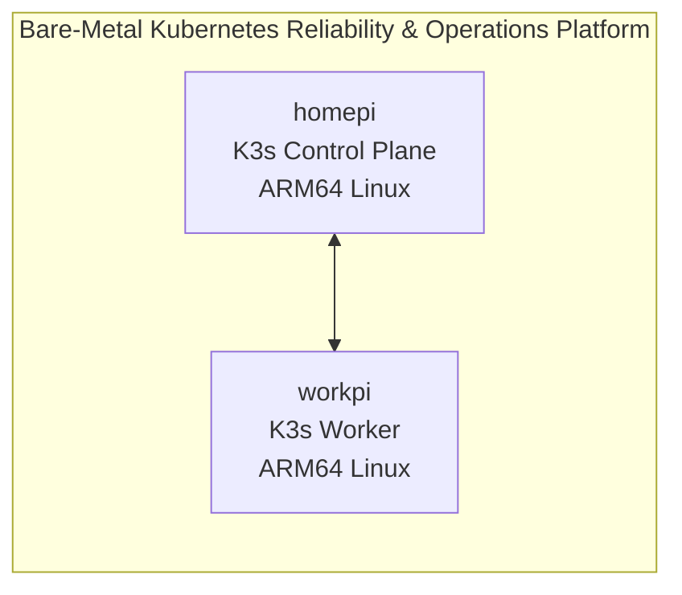

# Bare-Metal Kubernetes Reliability & Operations Platform

This repository documents and evolves a bare-metal Kubernetes reliability and operations platform for infrastructure engineering, data center operations, DevOps, and SRE workflows.

## Architecture

The current platform is a two-node ARM64 Linux K3s cluster running on physical Raspberry Pi systems:

- `homepi` provides the K3s server/control-plane role.
- `workpi` provides the K3s agent/worker role.



Detailed architecture documentation is maintained in [`docs/architecture/`](docs/architecture/).

## Baseline Evidence

Sanitized Phase 1 baseline evidence belongs in [`docs/baseline/`](docs/baseline/) and should remain separate from the root README.

## OpsPulse Application

OpsPulse is the operations console for the platform. The application now has a containerized Next.js frontend and a separate FastAPI backend designed for internal Kubernetes Service discovery.

Current verified-by-source capabilities include:

- two-node bare-metal ARM64 K3s platform documentation
- containerized Next.js frontend
- containerized FastAPI backend
- frontend liveness and readiness endpoints
- backend liveness and readiness endpoints
- replicated frontend and backend Deployment manifests
- internal `opspulse-api` ClusterIP Service manifest
- server-only frontend API configuration through `OPSPULSE_API_URL`
- graceful frontend behavior when the backend API is unavailable
- Prometheus, Grafana, Alertmanager, node-exporter, kube-state-metrics, and Prometheus Operator deployed through `kube-prometheus-stack`
- FastAPI `/metrics` instrumentation
- Prometheus-backed OpsPulse node utilization and API telemetry
- custom Grafana dashboard and Prometheus alert rules
- GitOps manifests for Argo CD declarative delivery
- Argo CD Application status surfaced through the OpsPulse API and frontend

See [`apps/frontend/README.md`](apps/frontend/README.md), [`apps/api/README.md`](apps/api/README.md), and [`docs/application/`](docs/application/) for local development, Docker usage, Kubernetes deployment files, and service-discovery details.

Phase 6 monitoring configuration is maintained in [`platform/monitoring/`](platform/monitoring/).

## GitOps & Delivery

Phase 9 GitOps configuration is maintained in [`gitops/`](gitops/) and documented in [`docs/gitops/`](docs/gitops/).

Implemented source-controlled capabilities include:

- Argo CD bootstrap and child Application manifests
- declarative OpsPulse delivery through Kustomize
- Helm-backed monitoring and logging delivery through Argo CD Applications
- automated sync, prune, and self-heal policy definitions
- Git-based rollback documentation
- GitOps Application health visibility through OpsPulse

Live validation evidence is tracked separately in [`docs/validation/`](docs/validation/) and should only be marked passed after execution on the K3s cluster.

## Repository Structure

| Path | Purpose |
| --- | --- |
| `apps/` | Application workload source and related components |
| `docs/` | Platform documentation, architecture notes, baseline evidence, and screenshots |
| `gitops/` | Argo CD bootstrap, Applications, and OpsPulse GitOps overlays |
| `incidents/` | Incident records and reliability exercises |
| `platform/` | Platform layer configuration areas such as monitoring, logging, storage, backup, security, and GitOps |
| `runbooks/` | Operational runbooks |
| `scripts/` | Operational scripts |

## Local Development

From the repository root:

```bash
make setup
make start
```

`make start` runs the FastAPI backend on `http://localhost:8000` and the Next.js frontend on `http://localhost:3000`. The frontend receives `OPSPULSE_API_URL=http://localhost:8000` as a server-only environment variable.

For local development, the backend reads live Kubernetes inventory through:

```bash
OPSPULSE_KUBECTL="ssh mo-abdulai@homepi.local sudo k3s kubectl"
```

That value is already the default in the root `Makefile`. Override it if you want to use a local kubeconfig instead, for example `OPSPULSE_KUBECTL=kubectl make start`. Inside Kubernetes, the deployed API uses its read-only service account instead.
