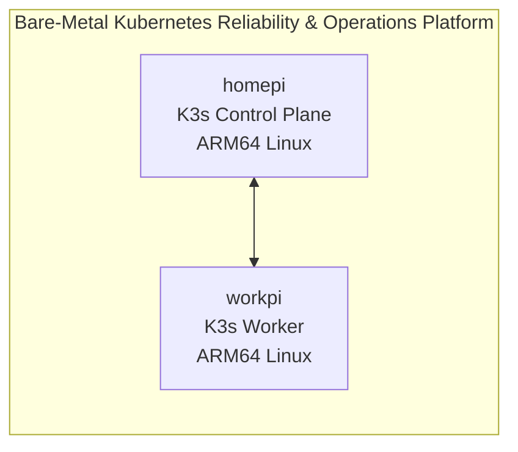

# Bare-Metal Kubernetes Reliability & Operations Platform

This repository documents and evolves a bare-metal Kubernetes reliability and operations platform for infrastructure engineering, data center operations, DevOps, and SRE workflows.

## Architecture

The current platform is a two-node ARM64 Linux K3s cluster running on physical Raspberry Pi systems:

- `homepi` provides the K3s server/control-plane role.
- `workpi` provides the K3s agent/worker role.

Detailed architecture documentation is maintained in [`docs/architecture/`](docs/architecture/).

## Baseline Evidence

Sanitized Phase 1 baseline evidence belongs in [`docs/baseline/`](docs/baseline/) and should remain separate from the root README.

## OpsPulse Application

OpsPulse is the operations console for the platform. The application now has a containerized Next.js frontend and a separate FastAPI backend designed for internal Kubernetes Service discovery.

Current verified-by-source capabilities include:

- two-node bare-metal ARM64 K3s platform documentation
- containerized Next.js frontend
- containerized FastAPI backend
- frontend liveness and readiness endpoints
- backend liveness and readiness endpoints
- replicated frontend and backend Deployment manifests
- internal `opspulse-api` ClusterIP Service manifest
- server-only frontend API configuration through `OPSPULSE_API_URL`
- graceful frontend behavior when the backend API is unavailable

See [`apps/frontend/README.md`](apps/frontend/README.md), [`apps/api/README.md`](apps/api/README.md), and [`docs/application/`](docs/application/) for local development, Docker usage, Kubernetes deployment files, and service-discovery details.

## Repository Structure

| Path | Purpose |
| --- | --- |
| `apps/` | Application workload source and related components |
| `docs/` | Platform documentation, architecture notes, baseline evidence, and screenshots |
| `incidents/` | Incident records and reliability exercises |
| `platform/` | Platform layer configuration areas such as monitoring, logging, storage, backup, security, and GitOps |
| `runbooks/` | Operational runbooks |
| `scripts/` | Operational scripts |
