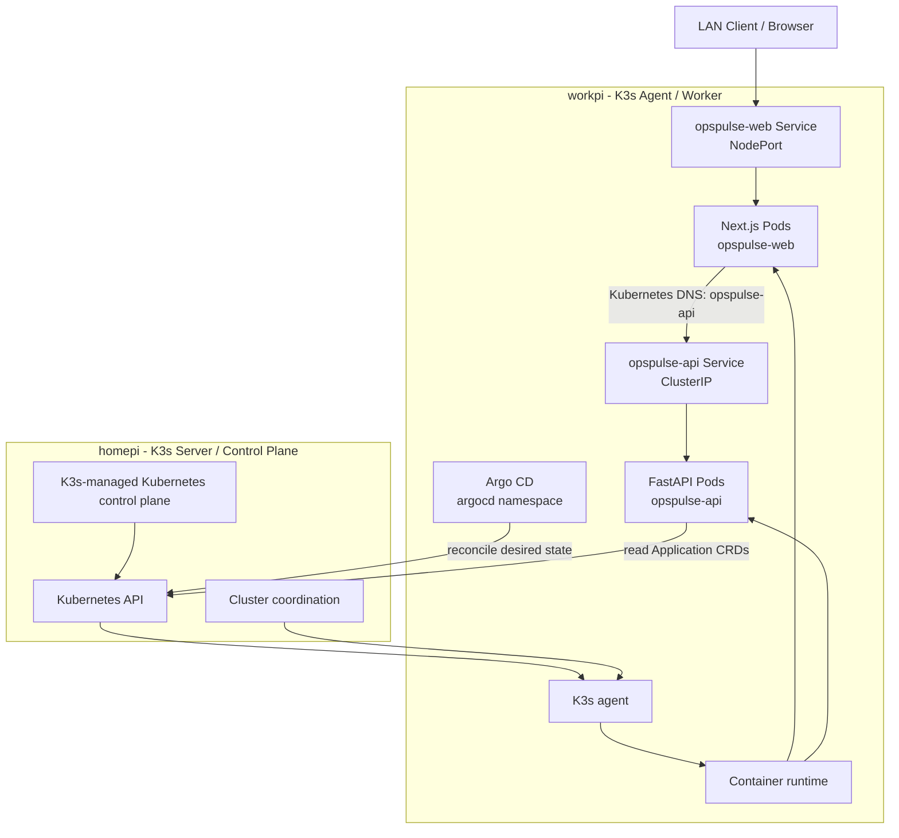

# Kubernetes Cluster Topology

## Cluster Summary

| Attribute | Value |
| --- | --- |
| Cluster type | Bare-metal |
| Kubernetes distribution | K3s |
| Node count | 2 |
| Control-plane node | `homepi` |
| Worker node | `workpi` |
| Architecture | ARM64 |
| Kubernetes version | `TODO: verify` |
| K3s version | `TODO: verify` |

The cluster is a two-node K3s environment running on physical Raspberry Pi systems. `homepi` provides the K3s server/control-plane role, and `workpi` provides K3s agent/worker capacity.

## Logical Cluster Diagram

The diagram represents K3s-managed responsibilities rather than separately installed control-plane components.

## Current Platform Capabilities

Verified from the platform description, the current environment supports:

- bare-metal Kubernetes operation on physical ARM64 systems
- K3s-based cluster management
- two-node cluster topology
- separated server/control-plane and worker roles
- workload execution on worker-node compute resources
- replicated Next.js frontend workload
- internal FastAPI backend workload
- ClusterIP service discovery between application components
- Prometheus-backed observability with node-exporter and kube-state-metrics
- Alertmanager and custom Prometheus alert rules
- project-specific Grafana operations dashboard
- node-level reliability and failure testing workflows
- Argo CD declarative delivery manifests and Application status integration

The following capabilities should be documented only after deployment and verification in later phases:

- centralized logging validation evidence
- GitOps live validation evidence
- backup and recovery workflows
- application-specific ingress and traffic management
- security controls beyond the baseline cluster configuration
