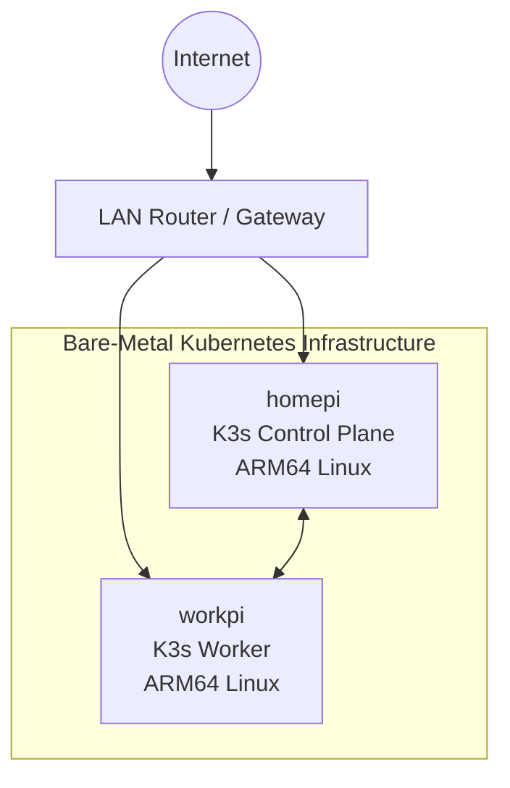

# Network Architecture

## Overview

The Bare-Metal Kubernetes Reliability & Operations Platform consists of two Raspberry Pi nodes connected through the local LAN and joined into one K3s cluster.

The local network provides node-to-node connectivity between `homepi` and `workpi`. `homepi` operates as the K3s server/control-plane node, and `workpi` operates as the K3s agent/worker node. Kubernetes control-plane communication is coordinated through the K3s server node, while workload traffic is handled by Kubernetes networking inside the cluster.

Router, gateway, DNS, interface, MAC address, and node IP details are intentionally omitted until they are verified from sanitized baseline output or read-only infrastructure inspection.

## Physical Network Topology



## Kubernetes Network Layer

The cluster uses K3s as the Kubernetes distribution. The following network-related capabilities are part of the intended K3s cluster model, but active component state should be verified from baseline evidence before recording implementation details:

| Component or Capability | Current Documentation Status |
| --- | --- |
| Node-to-node cluster communication | Present by design; exact network paths and addresses `TODO: verify` |
| Pod networking | Expected for K3s workload execution; CNI implementation `TODO: verify` |
| Kubernetes Services | Available through Kubernetes; deployed Service inventory `TODO: verify` |
| CoreDNS | K3s commonly deploys CoreDNS; active status `TODO: verify` |
| Flannel | K3s commonly uses Flannel by default; active status `TODO: verify` |
| Traefik | K3s commonly deploys Traefik by default; active status `TODO: verify` |
| ServiceLB | K3s commonly deploys ServiceLB by default; active status `TODO: verify` |

## Traffic Flow

External OpsPulse traffic:

```text
LAN client
-> opspulse-web NodePort Service
-> Next.js frontend Pod
```

Internal application traffic:

```text
Next.js frontend Pod
-> CoreDNS resolution for opspulse-api
-> opspulse-api ClusterIP Service
-> ready FastAPI Pod endpoint
```

The frontend uses the server-only `OPSPULSE_API_URL` value `http://opspulse-api:8000` inside Kubernetes. Browser-side JavaScript uses the frontend route `/api/platform/status` and does not receive the Kubernetes-internal API URL.

GitOps control traffic:

```text
Argo CD
-> GitHub repository
-> Kubernetes API desired-state reconciliation
```

GitOps visibility traffic:

```text
OpsPulse FastAPI
-> Kubernetes API
-> argoproj.io Application CRDs in argocd namespace
```

OpsPulse does not expose Argo CD credentials to the browser. The frontend receives only safe Application status fields from `GET /api/gitops/status`.

Later phases should expand this section as ingress, observability, centralized logging, GitOps, and additional application services are deployed and verified.
